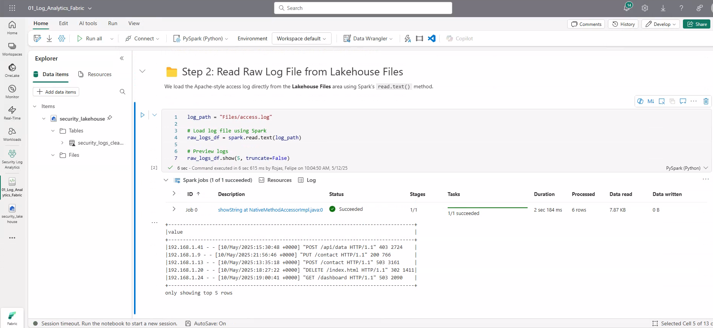

# 🔐 Log Analytics for Security

This PySpark project processes and analyzes log files to identify potential security risks, user behavior patterns, and anomaly events. Built on Microsoft Fabric with Delta Lake for scalable storage and real-time analytics.

---

## 📌 Problem Statement

Organizations generate massive log files daily from servers, apps, and devices. Analyzing this unstructured data is key to detecting suspicious access patterns, brute-force attempts, or data exfiltration events. This pipeline demonstrates a scalable way to structure, clean, and analyze logs using PySpark.

---

## 🛠️ Tech Stack

- PySpark (on Microsoft Fabric)
- Delta Lake Storage
- Microsoft Fabric Lakehouse
- Git & GitHub

---

## 🔁 Pipeline Overview

1. Ingest raw log files (Apache/Nginx/Custom logs)
2. Parse and extract key fields (IP, timestamp, path, response code, etc.)
3. Sessionize user activity
4. Apply filters and transformations to detect suspicious activity
5. Store cleaned data in Delta format in Fabric

---

## 🧱 Project Structure

```
log-analytics-for-security/
├── notebooks/
│   └── 01_Log_Analytics_Fabric.ipynb
├── data/
│   └── access.log
├── images/
│   └── (screenshots for README)
└── README.md
```

---

## 🚀 Key Features

- Parses common log formats (Apache/Nginx-style)
- Converts logs to structured Spark DataFrames
- Applies sessionization and anomaly detection
- Saves processed data as Delta tables on Fabric
- Ideal for audit trails and security dashboards

---

## 🖼️ Notebook Execution in Microsoft Fabric

Each step in this PySpark notebook was executed successfully in Microsoft Fabric. Below are visual references of the entire pipeline in action:

### Step 1: Start Spark Session


### Step 2: Read Raw Log File


### Step 3: Parse Log Lines


### Step 4: Clean and Filter


### Step 5: Detect Anomalies


### Step 6: Save to Delta


---

## 🏅 Author & Certifications

**Felipe Castro**  
Analytics Engineer @ EPAM Systems  

📜 [PL-300: Power BI Data Analyst](https://learn.microsoft.com/api/credentials/share/en-us/FelipeCastro-8026/F853AABE365874B3?sharingId=13D660F56C1DFFA3)  
📜 [DP-600: Fabric Analytics Engineer](https://learn.microsoft.com/api/credentials/share/en-us/FelipeCastro-8026/6C5A2F5A8A5864FC?sharingId=13D660F56C1DFFA3)

---
